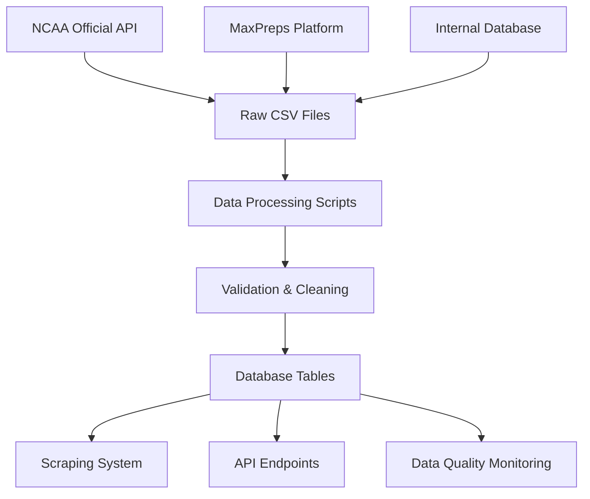

# School Stats Platform - Datasets

This directory contains all the raw and processed datasets used by the School Stats Platform for NCAA athletic program data collection and analysis.

## Directory Structure

```
datasets/
├── raw/                    # Original, unprocessed data files
├── processed/              # Cleaned and processed datasets
└── README.md               # This documentation
```

## Raw Datasets (`/raw`)

### NCAA Official Data

#### `complete-ncaa-schools-2025-08-15T04-48-51-945Z.csv`
- **Source**: NCAA Official API
- **Date**: August 15, 2025
- **Size**: ~157KB
- **Description**: Complete list of NCAA schools with official data including names, locations, conferences, and divisions
- **Usage**: Primary source for school verification and metadata

#### `ncaa-official-api-data-2025-08-15T04-44-35-388Z.csv`
- **Source**: NCAA Official API  
- **Date**: August 15, 2025
- **Size**: ~104KB
- **Description**: Detailed NCAA API data export with comprehensive school information
- **Usage**: Reference data for school validation and conference mapping

#### `ncaa-official-api-data-2025-08-15T04-46-11-373Z.csv`
- **Source**: NCAA Official API
- **Date**: August 15, 2025  
- **Size**: ~129KB
- **Description**: Extended NCAA dataset with additional school metadata
- **Usage**: Supplementary data for missing school information

#### `ncaa-official-api-data-2025-08-15T04-44-00-106Z.csv`
- **Source**: NCAA Official API
- **Date**: August 15, 2025
- **Size**: ~59 bytes
- **Description**: Minimal NCAA data extract (possibly empty or test file)
- **Usage**: Archive/testing reference

### Sports Reference Data

#### `sports_rows_from_db.csv`
- **Source**: Internal database export
- **Size**: ~3KB
- **Description**: Sports categories and classifications used in the platform
- **Fields**: Sport names, categories, standardized naming
- **Usage**: Sport classification and validation in scraping system

#### `sport_statistic_fields_rows_from_db.csv`
- **Source**: Internal database export
- **Size**: ~27KB
- **Description**: Comprehensive sport statistics field definitions
- **Fields**: Statistic names, data types, sport associations
- **Usage**: Athletic performance data structure reference

### MaxPreps Integration Data

#### `maxpreps_sports_list_v1.csv`
- **Source**: MaxPreps platform analysis
- **Size**: ~2KB
- **Description**: Complete list of sports tracked by MaxPreps
- **Fields**: Sport names, categories, popularity rankings
- **Usage**: Sport coverage validation and expansion planning

#### `maxpreps_sports_filtered.csv`
- **Source**: Processed MaxPreps data
- **Size**: ~695 bytes
- **Description**: Filtered list of relevant sports for recruiting focus
- **Fields**: High-priority sports for scholarship recruitment
- **Usage**: Prioritizing scraping efforts for key sports

#### `maxpreps_sports_stats_v1.csv`
- **Source**: MaxPreps platform analysis
- **Size**: ~48KB
- **Description**: Detailed statistics available per sport on MaxPreps
- **Fields**: Sport, statistic categories, data availability
- **Usage**: Athletic performance integration planning

## Data Processing Scripts

### Available Processing Commands

```bash
# Process raw NCAA data into school database
bun scripts/data-migration/process-ncaa-data.ts

# Validate and clean sports data
bun scripts/data-migration/process-sports-data.ts

# Import MaxPreps reference data
bun scripts/data-migration/import-maxpreps-data.ts
```

### Data Quality Standards

#### NCAA School Data
- **Completeness**: School name, state, division required
- **Validation**: Athletic website URLs verified
- **Standardization**: Conference names normalized
- **Deduplication**: Multiple records merged by name similarity

#### Sports Data
- **Normalization**: Sport names standardized (e.g., "Men's Basketball" → "Basketball")
- **Categorization**: Sports grouped by season, scholarship availability
- **Priority Scoring**: Sports ranked by recruitment importance

## Database Integration

### Primary Tables Populated

1. **`schools_ncaa_verified`** - From NCAA official data
   - Complete school profiles with verified athletic websites
   - Conference affiliations and geographic data
   - Contact information and institutional details

2. **`sports`** - From sports reference data
   - Standardized sport definitions
   - Season categorization (Fall, Winter, Spring)
   - Scholarship availability indicators

3. **`sport_statistics`** - From MaxPreps integration
   - Available performance metrics per sport
   - Data source mappings and validation rules

### Data Validation Rules

#### School Records
```typescript
interface SchoolValidation {
  name: { required: true, minLength: 5, maxLength: 100 };
  state: { required: true, format: /^[A-Z]{2}$/ };
  athletic_website: { format: /^https?:\/\/.+/ };
  conference: { standardized: true, nullable: true };
  athletic_division: { enum: ['I', 'II', 'III'], nullable: true };
}
```

#### Sport Records
```typescript
interface SportValidation {
  name: { required: true, standardized: true };
  category: { enum: ['Team', 'Individual', 'Combat'], required: true };
  season: { enum: ['Fall', 'Winter', 'Spring', 'Year-round'] };
  scholarship_available: { type: 'boolean', default: false };
}
```

## Data Update Procedures

### NCAA Data Refresh

1. **Frequency**: Monthly or when significant changes detected
2. **Process**:
   ```bash
   # Download latest NCAA data
   bun scripts/data-collection/fetch-ncaa-data.ts
   
   # Process and validate
   bun scripts/data-migration/process-ncaa-data.ts
   
   # Update database
   bun db:migrate
   ```

### Sports Data Updates

1. **Frequency**: Seasonally or when new sports added
2. **Process**:
   ```bash
   # Fetch MaxPreps updates
   bun scripts/data-collection/update-maxpreps-data.ts
   
   # Process sports classifications
   bun scripts/data-migration/process-sports-data.ts
   ```

## Data Quality Monitoring

### Automated Checks

```bash
# Run comprehensive data quality analysis
bun monitor:data-quality

# Validate school data completeness
bun scripts/monitoring/validate-school-data.ts

# Check for data anomalies
bun scripts/monitoring/detect-data-issues.ts
```

### Quality Metrics Tracked

- **School Coverage**: % of NCAA Division I schools with athletic websites
- **Data Completeness**: % of required fields populated per school
- **Contact Accuracy**: Validation rate of athletic website URLs
- **Sport Standardization**: % of sports using normalized names
- **Duplicate Detection**: Number of potential duplicate records

## Usage Examples

### Loading School Data for Scraping

```typescript
import fs from 'fs';
import csv from 'csv-parser';

// Load NCAA schools for scraping target list
const loadSchoolTargets = async () => {
  const schools = [];
  
  fs.createReadStream('datasets/raw/complete-ncaa-schools-2025-08-15T04-48-51-945Z.csv')
    .pipe(csv())
    .on('data', (row) => {
      if (row.athletic_website && row.division === 'I') {
        schools.push({
          name: row.name,
          website: row.athletic_website,
          conference: row.conference,
          priority: calculateScrapingPriority(row)
        });
      }
    })
    .on('end', () => {
      console.log(`Loaded ${schools.length} scraping targets`);
    });
};
```

### Sport Classification Lookup

```typescript
// Load sports reference data for classification
const loadSportsMapping = async () => {
  const sportsMap = new Map();
  
  fs.createReadStream('datasets/raw/sports_rows_from_db.csv')
    .pipe(csv())
    .on('data', (row) => {
      sportsMap.set(row.name.toLowerCase(), {
        standardName: row.standardized_name,
        category: row.category,
        season: row.season,
        hasScholarships: row.scholarship_available === 'true'
      });
    });
    
  return sportsMap;
};
```

## Data Lineage



## Contributing

### Adding New Datasets

1. Place raw data files in `/raw` directory
2. Document data source, date, and structure
3. Create processing script in `/scripts/data-migration/`
4. Update this README with dataset description
5. Add validation rules and quality checks

### Data Quality Issues

Report data quality issues by:
1. Running quality monitoring: `bun monitor:data-quality`
2. Documenting specific issues found
3. Creating data correction scripts
4. Testing corrections on sample data
5. Applying fixes to production datasets

## Archive Policy

- **Raw datasets**: Retained indefinitely for historical reference
- **Processed datasets**: Current version + 2 previous versions
- **Quality reports**: Monthly retention, annual archives
- **Processing logs**: 90-day retention for debugging

---

*Last Updated: August 27, 2025*  
*Dataset Version: v1.0.0*  
*Platform: School Stats v1.0.0*